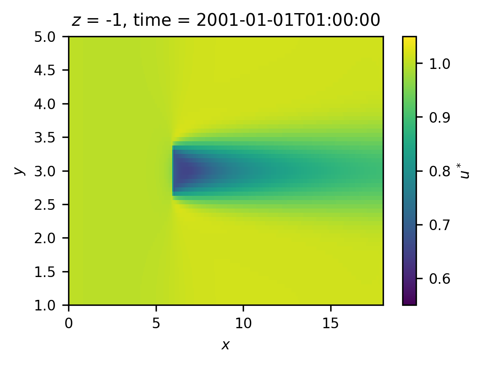
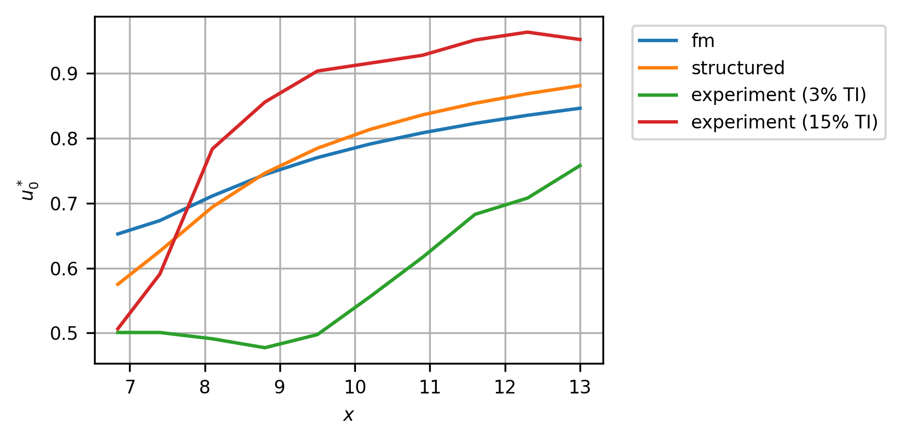
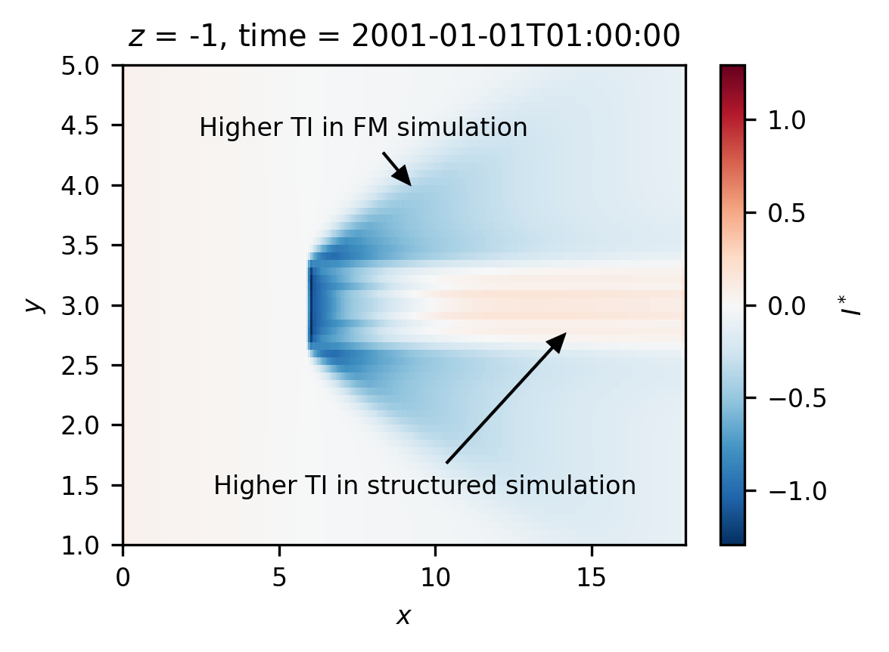
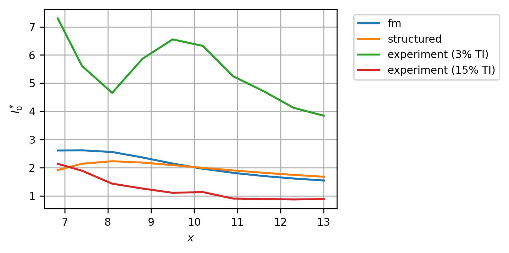

==========================
Model Comparison (Windows)
==========================

Introduction
============

This is a comparison of the performance of simulations of the Mycek
flume experiment (Mycek et al. 2014) using the flexible mesh (FM) and
structured grid solvers for Delft3D. The simulation settings are
mirrored between the two methods as much as possible. The chosen grid
resolution for this study is 0.0625m. Axial and radial velocities and
turbulence intensity (TI) in the horizontal plane intersecting the
turbine hub will be examined.

.. _`sec:axial`:

Axial Velocity Comparison
=========================

This section compares axial velocities between the FM and structured
grid models. Figs. 1, 2 show the axial velocity over the horizontal
plane intersecting the turbine hub for the FM and structured gird
models, respectively. The units are non-dimensionalised by the
free-stream velocity, measured at the hub location without the presence
of the turbine. If :math:`u` is the dimensional velocity, and
:math:`u_\infty` is the dimensional free stream velocity, then the
normalized velocity :math:`u^* = u / u_\infty`. Note the observable
difference in the wake velocities immediately downstream of the turbine
between the two simulations.

         for the fm model type
   :name: fig:turb_z_u_fm
   :width: 3.64in

   Figure 1: Axial velocity normalised by the free stream velocity for
   the fm model type

         for the structured model type
   :name: fig:turb_z_u_structured
   :width: 3.64in

   Figure 2: Axial velocity normalised by the free stream velocity for
   the structured model type

Fig. 3 shows the error between the non-dimensional axial velocities of
the structured grid and FM models, relative to the maximum value within
the two simulations. Three main areas of difference are revealed, the
increased deficit in the near wake for the structured model, the reduced
deficit of the structured model in the far wake and the increased
acceleration around the edges of the turbine of the structured model.

         the structured and fm models
   :name: fig:turb_z_u_diff
   :width: 3.64in

   Figure 3: Relative error in normalised axial velocity between the
   structured and fm models

Comparing the non-dimensional centerline velocities alongside the
experimental data (published in (Mycek et al. 2014)) for two turbulence
intensity (TI) levels, in fig. 4, confirms the behavior in the near and
far wake shown in fig. 3. Generally, the structured model performs
better in the near wake compared to the experimental data. In the far
wake, the FM model better repesents the 3% TI experimental data, and the
structured model matches better to the 15% TI experimental data.
Nonetheless, neither model captures the experimental measurements well
for the whole centerline. Note that the TI within the Delft3D
simulations is between 5% and 6%.

         velocity. Experimental data reverse engineered from (Mycek et al.
         2014, fig. 11a & 11b).
   :name: fig:transect_u
   :width: 5.5in

   Figure 4: Comparison of the normalised turbine centerline velocity.
   Experimental data reverse engineered from (Mycek et al. 2014, fig.
   11a & 11b).

.. _`sec:radial`:

Radial Velocity Comparison
==========================

This section compares radial velocities between the FM and structured
grid models. Figs. 5, 6 show the radial velocity over the horizontal
plane intersecting the turbine hub for the FM and structured gird
models, respectively. The units are non-dimensionalized by the
free-stream velocity, (in the axial direction) measured at the hub
location without the presence of the turbine. If :math:`v` is the
dimensional velocity, then the normalized velocity
:math:`v^* = v / u_\infty`. Note the increased radial velocities
recorded for the structured grid compared to the FM simulation.

         velocity for the fm model type
   :name: fig:turb_z_v_fm
   :width: 3.64in

   Figure 5: Radial velocity normalised by the free stream velocity for
   the fm model type

.. figure:: turb_z_v_structured.png
   :alt: Figure 6: Radial velocity normalised by the free stream
         velocity for the structured model type
   :name: fig:turb_z_v_structured
   :width: 3.64in

   Figure 6: Radial velocity normalised by the free stream velocity for
   the structured model type

Fig. 7 shows the error between the non-dimensional radial velocities of
the structured grid and FM models, relative to the maximum value within
the two simulations. The largest errors are seen upstream of the
turbine, while smaller errors are seen downstream of the turbine. The
errors in the radial flow are also much higher than for the axial flow,
with the maximum error in radial velocity being 0.2425, while the error
is 0.08593 for the axial velocity (from fig. 3).

.. figure:: turb_z_v_diff.png
   :alt: Figure 7: Relative error in normalised radial velocity between
         the structured and fm models
   :name: fig:turb_z_v_diff
   :width: 3.64in

   Figure 7: Relative error in normalised radial velocity between the
   structured and fm models

.. _`sec:TI`:

Turbulence Intensity Comparison
===============================

This section compares turbulence intensity (TI) values between the FM
and structured grid models. Figs. 8, 9 show the normalized TI over the
horizontal plane intersecting the turbine hub for the FM and structured
gird models, respectively. The units are non-dimensionalized by the
free-stream TI measured at the hub location without the presence of the
turbine. For the structured grid simulation the free stream TI is 5.273
% and for the FM simulation it is 5.281 %. If :math:`I` is the
dimensional TI, then the normalized TI :math:`I^* = I / I_\infty`. Note
the increased levels of TI over wider radial distances from the wake
centreline for the FM model, while the increased TI is concentrated
directly downstream of the turbine for the structured grid simulation.
This differing behaviour is confirmed when differencing the two
simulations, as shown in fig. 10.

.. figure:: turb_z_ti_fm.png
   :alt: Figure 8: Turbulence intensity normalised by the free-stream
         value measured at the turbine hub, :math:`I^*`, for the fm model type
   :name: fig:turb_z_ti_fm
   :width: 3.64in

   Figure 8: Turbulence intensity normalised by the free-stream value
   measured at the turbine hub, :math:`I^*`, for the fm model type

.. figure:: turb_z_ti_structured.png
   :alt: Figure 9: Turbulence intensity normalised by the free-stream
         value measured at the turbine hub, :math:`I^*`, for the structured
         model type
   :name: fig:turb_z_ti_structured
   :width: 3.64in

   Figure 9: Turbulence intensity normalised by the free-stream value
   measured at the turbine hub, :math:`I^*`, for the structured model
   type

         and FM simulations
   :name: fig:turb_z_ti_diff
   :width: 3.64in

   Figure 10: Difference in normalised TI between the structured and FM
   simulations

The non-dimensional TI values along the wake centerline are compared
with the experimental data (published in (Mycek et al. 2014)) for two
turbulence intensity (TI) levels in fig. 11. Both the structured and FM
models more closely represent the results from the 15% TI experimental
data, although both simulations fail to capture the mixing behaviour in
the far wake. Neither simulation resembles the very large increases in
normalized TI seen in the 3% TI experimental data.

         tubulence intensity. Experimental data reverse engineered from (Mycek
         et al. 2014, fig. 11c & 11d).
   :name: fig:transect_ti
   :width: 5.5in

   Figure 11: Comparison of the normalised turbine centerline tubulence
   intensity. Experimental data reverse engineered from (Mycek et al.
   2014, fig. 11c & 11d).

Conclusion
==========

Comparison of simulations of the 2014 Mycek flume experiment (Mycek et
al. 2014) using the flexible mesh (FM) and structured grid solvers for
Delft3D, reveals significant differences. As seen in sec. 2, differences
in the axial velocities between the two methods were seen in the near
wake, far wake, and at the turbine edges. When comparing to the
experimental data, as in fig. 3, it was observed that the structured
grid simulation performs better in the near wake, while the FM
simulation is better in the far wake.

In sec. 3, radial velocities were compared with differences seen
immediately upstream and downstream of the turbine (see fig. 7).
Notably, the maximum relative errors between the two simulations were
much larger for the radial velocities than then axial velocities, 0.2425
and 0.08593 respectively.

In sec. 4 turbulence intensity (TI) values are compared between the two
simulation types and the experimental data. The distribution of TI in
the turbine wake clearly differs between the FM and structured
simulations, with increased TI seen at much greater radial distances
from the turbine centerline in the FM simulations (see figs. 8-10).
Compared to the experimental data both simulation types are similar to
the 15% TI experimental data in the near wake although they fail to
capture the amount of mixing in the far wake. The large increases in
normalized TI of the 3% TI experiment are not recreated. Failure to
precisely match the TI values of the experiments in the simulations may
account for some of the differences seen.

These discrepancies may account for some of the differences seen in the
axial flows, although the underlying mechanisms are not yet known. Other
factors may also be contributing, including interpretation of the
simulation parameters or selection of the time step for the structured
grid simulations.

References
----------

.. container:: references csl-bib-body hanging-indent
   :name: refs

   .. container:: csl-entry
      :name: ref-mycek2014

      Mycek, Paul, Benoît Gaurier, Grégory Germain, Grégory Pinon, and
      Elie Rivoalen. 2014. “Experimental Study of the Turbulence
      Intensity Effects on Marine Current Turbines Behaviour. Part I:
      One Single Turbine.” *Renewable Energy* 66: 729–46.
      https://doi.org/10.1016/j.renene.2013.12.036.
