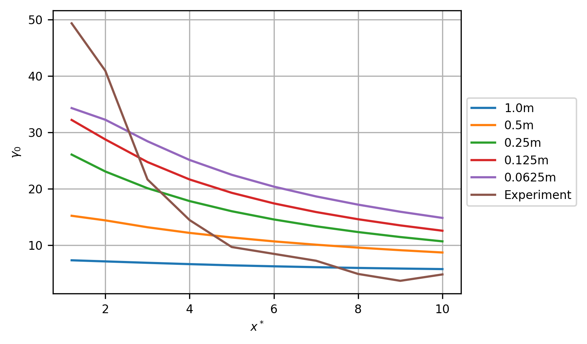

Grid Convergence Study (Linux)
==============================

Summary
-------

This is a grid convergence study of 5 cases. The case with the finest
grid resolution, of 0.0625m, achieved an asymptotic ratio of 1.032
(asymptotic range is indicated by a value :math:`\approx 1`). At zero
grid resolution, the normalised velocity deficit measured 1.2 diameters
downstream from the turbine was 35.85%, a 28.18% error against the
measured value of 49.92% for the 3% ambient turbulence intensity (TI)
experiment. At zero grid resolution the turbulence intensity measured
1.2 diameters downstream from the turbine was 15.2%, an error of 69.42%
against the measured value of 21.9% for the 3% ambient TI experiment.
The simulated ambient TI, at zero grid resolution, is 5.394%.

For the centreline velocity (3% TI) transect, the root mean square error
at the lowest grid resolution was 0.1954 (m/s). For the centreline
velocity (15% TI) transect, the root mean square error at the lowest
grid resolution was 0.1172 (m/s). For the axial velocity at
:math:`x^*=5` (3% TI) transect, the root mean square error at the lowest
grid resolution was 0.1167 (m/s). For the axial velocity at
:math:`x^*=5` (15% TI) transect, the root mean square error at the
lowest grid resolution was 0.06263 (m/s). For the centreline turbulence
intensity (3% TI) transect, the root mean square error at the lowest
grid resolution was 5.785 (%). For the centreline turbulence intensity
(15% TI) transect, the root mean square error at the lowest grid
resolution was 8.987 (%).

Grid Convergence Studies
------------------------

Free Stream Velocity
~~~~~~~~~~~~~~~~~~~~

This section presents the convergence study for the free stream velocity
(:math:`U_\infty`). For the final case, with grid resolution of 0.0625m,
an asymptotic ratio of 0.9994 was achieved (asymptotic range is
indicated by a value :math:`\approx 1`). The free stream velocity at
zero grid resolution is 0.8053m/s. The grid resolution required for a
fine-grid GCI of 1.0% is 0.2808m.

.. table:: Free stream velocity (:math:`U_\infty`) per grid resolution
           with computational cells and error against value at zero grid resolution

   ============== ======= ====================== ===========
   resolution (m) # cells :math:`U_\infty` (m/s) error
   ============== ======= ====================== ===========
   1              144     0.757747               0.0591016
   0.5            1152    0.783403               0.0272444
   0.25           9216    0.80086                0.00556725
   0.125          73728   0.804829               0.000638789
   0.0625         589824  0.805285               7.32951e-05
   ============== ======= ====================== ===========

         resolution per grid resolution
   :width: 3.64in

   Free stream velocity error against value at zero grid resolution per
   grid resolution

Free Stream Turbulence Intensity
~~~~~~~~~~~~~~~~~~~~~~~~~~~~~~~~

This section presents the convergence study for the free stream
turbulence intensity (:math:`I_\infty`). For the final case, with grid
resolution of 0.0625m, an asymptotic ratio of 14.95 was achieved
(asymptotic range is indicated by a value :math:`\approx 1`). The free
stream velocity at zero grid resolution is 5.394%. The grid resolution
required for a fine-grid GCI of 1.0% is 0.03819m.

.. table:: Free stream turbulence intensity (:math:`I_\infty`) per grid
           resolution with computational cells and error against value at zero grid
           resolution

   ============== ======= ==================== =========
   resolution (m) # cells :math:`I_\infty` (%) error
   ============== ======= ==================== =========
   1              144     8.18034              0.516566
   0.5            1152    6.4764               0.20067
   0.25           9216    4.85727              0.0995036
   0.125          73728   4.94206              0.0837847
   0.0625         589824  5.28091              0.0209649
   ============== ======= ==================== =========

.. figure:: ti_infty_convergence.png
   :alt: Free stream turbulence intensity error against value at zero
         grid resolution per grid resolution
   :width: 3.64in

   Free stream turbulence intensity error against value at zero grid
   resolution per grid resolution

Wake Velocity
~~~~~~~~~~~~~

This section presents the convergence study for the wake centerline
velocity measured 1.2 diameters downstream from the turbine
(:math:`U_{1.2D}`). For the final case, with grid resolution of 0.0625m,
an asymptotic ratio of 1.032 was achieved (asymptotic range is indicated
by a value :math:`\approx 1`). The free stream velocity at zero grid
resolution is 0.5166m/s. The grid resolution required for a fine-grid
GCI of 1.0% is 0.03873m.

.. table:: Wake centerline velocity 1.2 diameters downstream
           (:math:`U_{1.2D}`) per grid resolution with computational cells and
           error against value at zero grid resolution

   ============== ======= ====================== =========
   resolution (m) # cells :math:`U_{1.2D}` (m/s) error
   ============== ======= ====================== =========
   1              144     0.74141                0.435113
   0.5            1152    0.678241               0.312841
   0.25           9216    0.591398               0.144743
   0.125          73728   0.542273               0.0496528
   0.0625         589824  0.525421               0.017033
   ============== ======= ====================== =========

         grid resolution
   :width: 3.64in

   Wake velocity error against value at zero grid resolution per grid
   resolution

Wake Turbulence Intensity
~~~~~~~~~~~~~~~~~~~~~~~~~

This section presents the convergence study for the wake centerline
turbulence intensity (TI) measured 1.2 diameters downstream from the
turbine (:math:`I_{1.2D}`). For the final case, with grid resolution of
0.0625m, an asymptotic ratio of 0.8836 was achieved (asymptotic range is
indicated by a value :math:`\approx 1`). TI at zero grid resolution is
15.2%. The grid resolution required for a fine-grid GCI of 1.0% is
0.006075m.

.. table:: Wake centerline TI 1.2 diameters downstream
           (:math:`I_{1.2D}`) per grid resolution with computational cells and
           error against value at zero grid resolution

   ============== ======= ===================== ========
   resolution (m) # cells :math:`I_{1.2D} (\%)` error
   ============== ======= ===================== ========
   1              144     8.29067               0.454552
   0.5            1152    7.66767               0.49554
   0.25           9216    8.75471               0.424023
   0.125          73728   12.1812               0.19859
   0.0625         589824  13.786                0.093009
   ============== ======= ===================== ========

         resolution
   :width: 3.64in

   Wake TI error against value at zero grid resolution per grid
   resolution

Validation
~~~~~~~~~~

At zero grid resolution, the normalised deficit of :math:`U_{1.2D}`,
(:math:`\gamma_{0(1.2D)}`) is 35.85%, a 28.18% error against the
measured value of 49.92%.

Wake Transects
--------------

This section presents axial velocity transects along the turbine
centreline and at cross-sections along the :math:`y`-axis. Errors are
reported relative to the experimental data given in (Mycek et al. 2014).

Centreline velocity (3% TI)
~~~~~~~~~~~~~~~~~~~~~~~~~~~

The root mean square error (RMSE) for this transect at the finest grid
resolution of 0.0625m was 0.1954 (m/s).

.. table:: Root mean square error (RMSE) for the normalised velocity,
           :math:`u^*_0`, per grid resolution.

   ============== ==========
   resolution (m) RMSE (m/s)
   ============== ==========
   1              0.419804
   0.5            0.335561
   0.25           0.26347
   0.125          0.22455
   0.0625         0.195446
   ============== ==========

.. figure:: transect_u0_0.png
   :alt: Normalised velocity, :math:`u^*_0`, (m/s) per grid resolution
         comparison. Experimental data reverse engineered from (Mycek et al.
         2014, fig. 11a).
   :width: 5.68in

   Normalised velocity, :math:`u^*_0`, (m/s) per grid resolution
   comparison. Experimental data reverse engineered from (Mycek et al.
   2014, fig. 11a).

         resolution comparison. Experimental data reverse engineered from
         (Mycek et al. 2014, fig. 11a).
   :width: 5.68in

   Normalised velocity deficit, :math:`\gamma_0`, (%) per grid
   resolution comparison. Experimental data reverse engineered from
   (Mycek et al. 2014, fig. 11a).

Centreline velocity (15% TI)
~~~~~~~~~~~~~~~~~~~~~~~~~~~~

The root mean square error (RMSE) for this transect at the finest grid
resolution of 0.0625m was 0.1172 (m/s).

.. table:: Root mean square error (RMSE) for the normalised velocity,
           :math:`u^*_0`, per grid resolution.

   ============== ==========
   resolution (m) RMSE (m/s)
   ============== ==========
   1              0.212807
   0.5            0.149742
   0.25           0.106792
   0.125          0.10218
   0.0625         0.117195
   ============== ==========

         comparison. Experimental data reverse engineered from (Mycek et al.
         2014, fig. 11b).
   :width: 5.68in

   Normalised velocity, :math:`u^*_0`, (m/s) per grid resolution
   comparison. Experimental data reverse engineered from (Mycek et al.
   2014, fig. 11b).

         resolution comparison. Experimental data reverse engineered from
         (Mycek et al. 2014, fig. 11b).
   :width: 5.68in

   Normalised velocity deficit, :math:`\gamma_0`, (%) per grid
   resolution comparison. Experimental data reverse engineered from
   (Mycek et al. 2014, fig. 11b).

Axial velocity at :math:`x^*=5` (3% TI)
~~~~~~~~~~~~~~~~~~~~~~~~~~~~~~~~~~~~~~~

The root mean square error (RMSE) for this transect at the finest grid
resolution of 0.0625m was 0.1167 (m/s).

.. table:: Root mean square error (RMSE) for the normalised velocity,
           :math:`u^*_0`, per grid resolution.

   ============== ==========
   resolution (m) RMSE (m/s)
   ============== ==========
   1              0.213179
   0.5            0.174207
   0.25           0.144064
   0.125          0.128447
   0.0625         0.116704
   ============== ==========

         comparison. Experimental data reverse engineered from (Mycek et al.
         2014, fig. A12a).
   :width: 5.68in

   Normalised velocity, :math:`u^*_0`, (m/s) per grid resolution
   comparison. Experimental data reverse engineered from (Mycek et al.
   2014, fig. A12a).

         resolution comparison. Experimental data reverse engineered from
         (Mycek et al. 2014, fig. A12a).
   :width: 5.68in

   Normalised velocity deficit, :math:`\gamma_0`, (%) per grid
   resolution comparison. Experimental data reverse engineered from
   (Mycek et al. 2014, fig. A12a).

Axial velocity at :math:`x^*=5` (15% TI)
~~~~~~~~~~~~~~~~~~~~~~~~~~~~~~~~~~~~~~~~

The root mean square error (RMSE) for this transect at the finest grid
resolution of 0.0625m was 0.06263 (m/s).

.. table:: Root mean square error (RMSE) for the normalised velocity,
           :math:`u^*_0`, per grid resolution.

   ============== ==========
   resolution (m) RMSE (m/s)
   ============== ==========
   1              0.0609747
   0.5            0.0330307
   0.25           0.0432415
   0.125          0.053325
   0.0625         0.0626312
   ============== ==========

         comparison. Experimental data reverse engineered from (Mycek et al.
         2014, fig. A12a).
   :width: 5.68in

   Normalised velocity, :math:`u^*_0`, (m/s) per grid resolution
   comparison. Experimental data reverse engineered from (Mycek et al.
   2014, fig. A12a).

         resolution comparison. Experimental data reverse engineered from
         (Mycek et al. 2014, fig. A12a).
   :width: 5.68in

   Normalised velocity deficit, :math:`\gamma_0`, (%) per grid
   resolution comparison. Experimental data reverse engineered from
   (Mycek et al. 2014, fig. A12a).

Centreline turbulence intensity (3% TI)
~~~~~~~~~~~~~~~~~~~~~~~~~~~~~~~~~~~~~~~

The root mean square error (RMSE) for this transect at the finest grid
resolution of 0.0625m was 5.785 (%).

.. table:: Root mean square error (RMSE) for the turbulence intensity,
           :math:`I_0`, per grid resolution.

   ============== ========
   resolution (m) RMSE (%)
   ============== ========
   1              8.68781
   0.5            9.4221
   0.25           9.19553
   0.125          7.04457
   0.0625         5.78451
   ============== ========

         comparison. Experimental data reverse engineered from (Mycek et al.
         2014, fig. 11c).
   :width: 5.68in

   Turbulence intensity, :math:`I_0`, (%) per grid resolution
   comparison. Experimental data reverse engineered from (Mycek et al.
   2014, fig. 11c).

Centreline turbulence intensity (15% TI)
~~~~~~~~~~~~~~~~~~~~~~~~~~~~~~~~~~~~~~~~

The root mean square error (RMSE) for this transect at the finest grid
resolution of 0.0625m was 8.987 (%).

.. table:: Root mean square error (RMSE) for the turbulence intensity,
           :math:`I_0`, per grid resolution.

   ============== ========
   resolution (m) RMSE (%)
   ============== ========
   1              12.3491
   0.5            13.0006
   0.25           12.6459
   0.125          10.322
   0.0625         8.98737
   ============== ========

         comparison. Experimental data reverse engineered from (Mycek et al.
         2014, fig. 11d).
   :width: 5.68in

   Turbulence intensity, :math:`I_0`, (%) per grid resolution
   comparison. Experimental data reverse engineered from (Mycek et al.
   2014, fig. 11d).

References
----------

.. container:: references csl-bib-body hanging-indent
   :name: refs

   .. container:: csl-entry
      :name: ref-mycek2014

      Mycek, Paul, Benoît Gaurier, Grégory Germain, Grégory Pinon, and
      Elie Rivoalen. 2014. “Experimental Study of the Turbulence
      Intensity Effects on Marine Current Turbines Behaviour. Part I:
      One Single Turbine.” *Renewable Energy* 66: 729–46.
      https://doi.org/10.1016/j.renene.2013.12.036.
