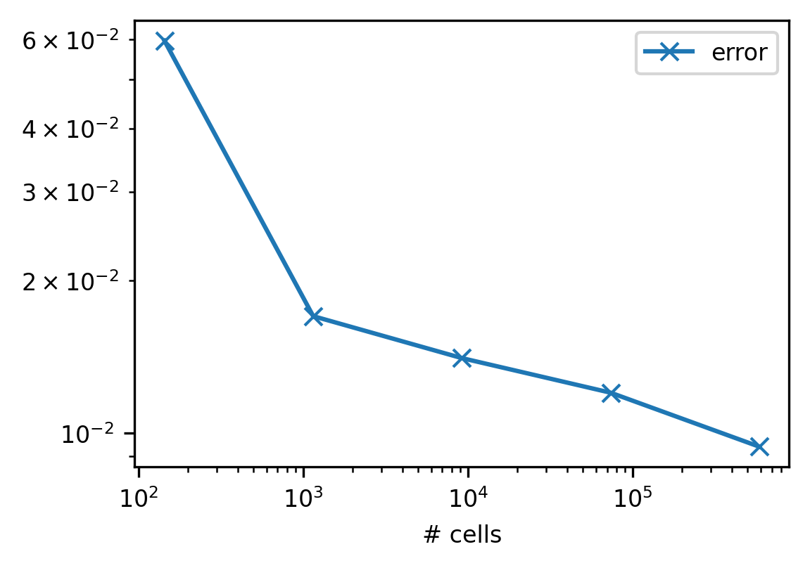
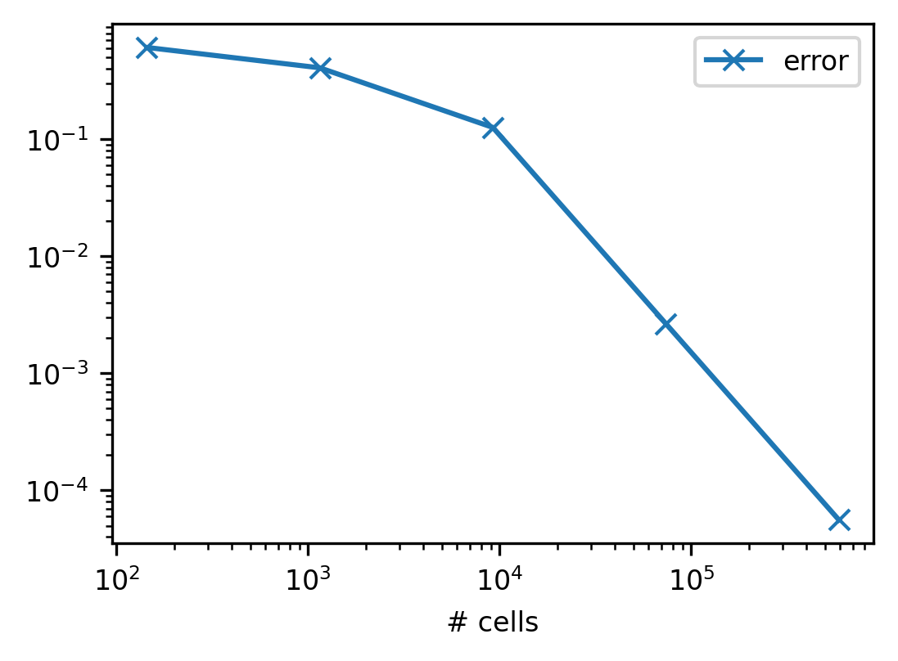
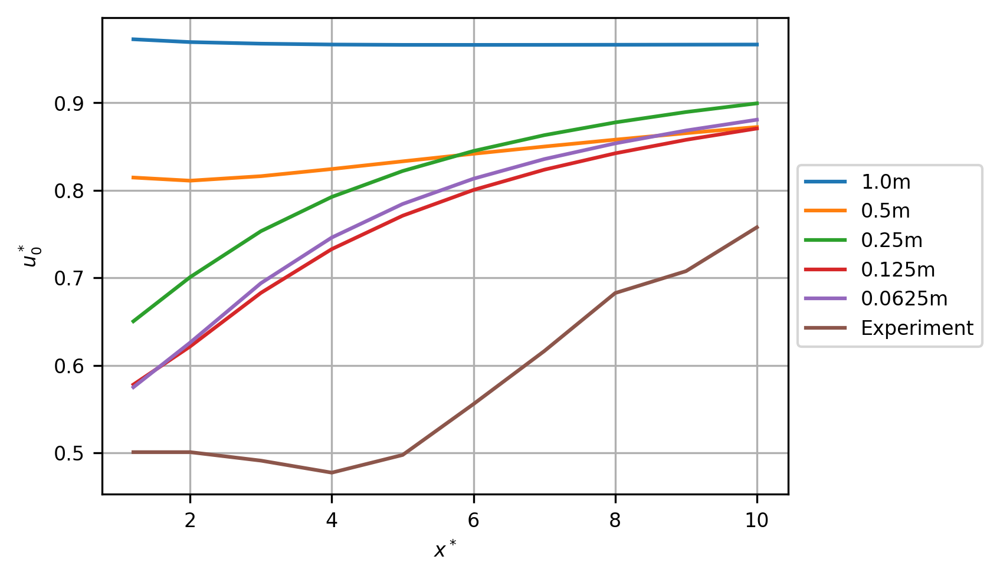
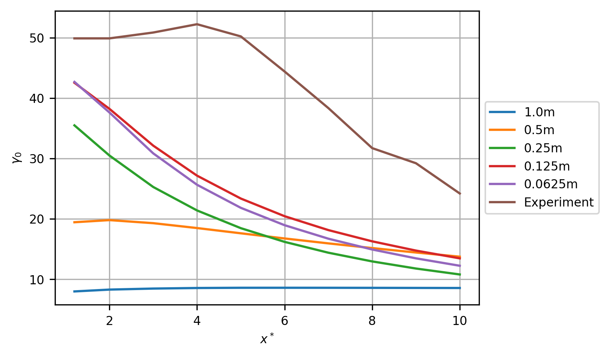
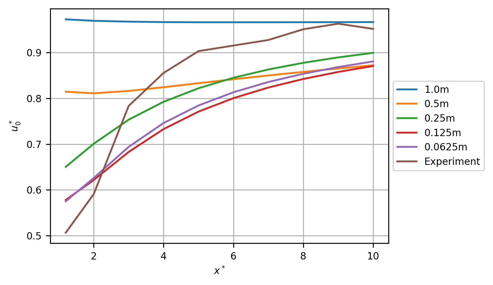
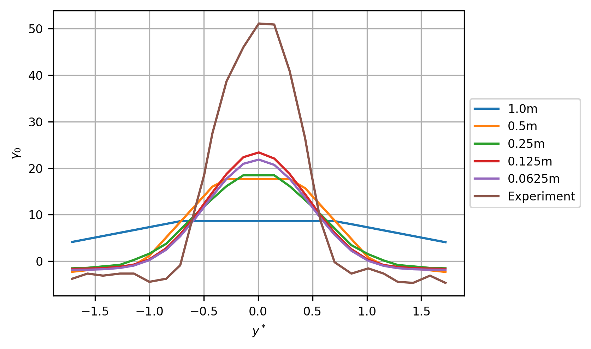
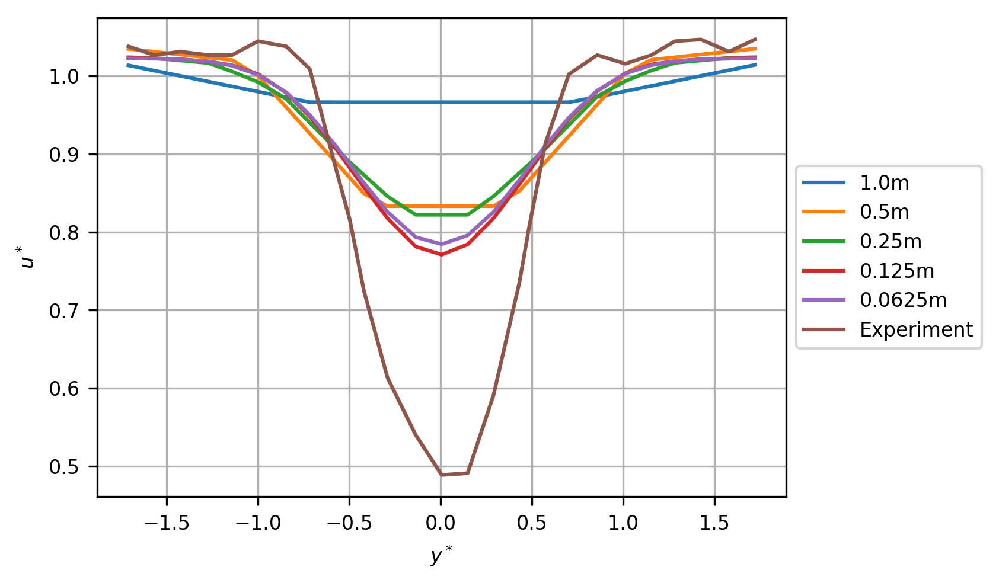
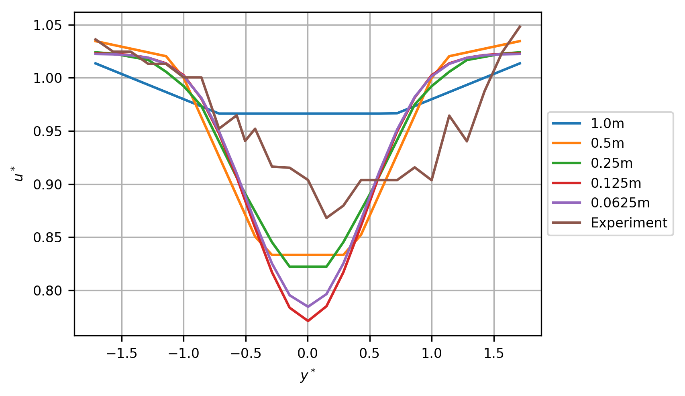
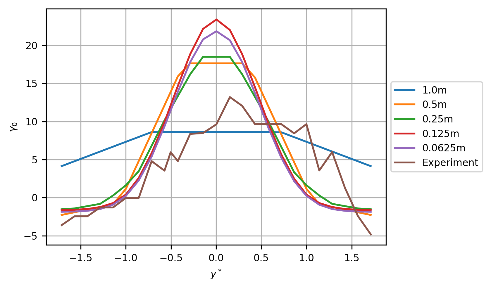

Grid Convergence Study (Linux)
==============================

Summary
-------

This is a grid convergence study of 5 cases. The case with the finest
grid resolution, of 0.0625m, achieved an asymptotic ratio of 1.003
(asymptotic range is indicated by a value :math:`\approx 1`). At zero
grid resolution, the normalised velocity deficit measured 1.2 diameters
downstream from the turbine was 43.04%, a 13.78% error against the
measured value of 49.92%. For the centreline velocity (3% TI) transect,
the root mean square error at the lowest grid resolution was 0.2004. For
the centreline velocity (15% TI) transect, the root mean square error at
the lowest grid resolution was 0.09075. For the axial velocity at
:math:`x^*=5` (3% TI) transect, the root mean square error at the lowest
grid resolution was 0.1232. For the axial velocity at :math:`x^*=5` (15%
TI) transect, the root mean square error at the lowest grid resolution
was 0.05688.

Grid Convergence Studies
------------------------

Free Stream Velocity
~~~~~~~~~~~~~~~~~~~~

This section presents the convergence study for the free stream velocity
(:math:`U_\infty`). For the final case, with grid resolution of 0.0625m,
an asymptotic ratio of 1.63 was achieved (asymptotic range is indicated
by a value :math:`\approx 1`). The free stream velocity at zero grid
resolution is 0.8046m/s. The grid resolution required for a fine-grid
GCI of 1.0% is 0.03862m.

.. table:: Free stream velocity (:math:`U_\infty`) per grid resolution
           with computational cells and error against value at zero grid resolution

   ============== ======= ================ ==========
   resolution (m) # cells :math:`U_\infty` error
   ============== ======= ================ ==========
   1              144     0.756681         0.0595775
   0.5            1152    0.790921         0.0170232
   0.25           9216    0.793301         0.0140648
   0.125          73728   0.794949         0.0120173
   0.0625         589824  0.797055         0.00939936
   ============== ======= ================ ==========

         resolution per grid resolution
   :width: 3.64in

   Free stream velocity error against value at zero grid resolution per
   grid resolution

Wake Velocity
~~~~~~~~~~~~~

This section presents the convergence study for the wake centerline
velocity measured 1.2 diameters downstream from the turbine
(:math:`U_{1.2D}`). For the final case, with grid resolution of 0.0625m,
an asymptotic ratio of 1.003 was achieved (asymptotic range is indicated
by a value :math:`\approx 1`). The free stream velocity at zero grid
resolution is 0.4583m/s. The grid resolution required for a fine-grid
GCI of 1.0% is 0.1524m.

.. table:: Wake centerline velocity 1.2 diameters downstream
           (:math:`U_{1.2D}`) per grid resolution with computational cells and
           error against value at zero grid resolution

   ============== ======= ================ ===========
   resolution (m) # cells :math:`U_{1.2D}` error
   ============== ======= ================ ===========
   1              144     0.736009         0.605977
   0.5            1152    0.644324         0.405919
   0.25           9216    0.515944         0.125793
   0.125          73728   0.45951          0.00265517
   0.0625         589824  0.458319         5.60439e-05
   ============== ======= ================ ===========

         grid resolution
   :width: 3.64in

   Wake velocity error against value at zero grid resolution per grid
   resolution

Validation
~~~~~~~~~~

At zero grid resolution, the normalised deficit of :math:`U_{1.2D}`,
(:math:`\gamma_{0(1.2D)}`) is 43.04%, a 13.78% error against the
measured value of 49.92%.

Wake Transects
--------------

This section presents axial velocity transects along the turbine
centreline and at cross-sections along the :math:`y`-axis. Errors are
reported relative to the experimental data given in (Mycek et al. 2014).

Centreline velocity (3% TI)
~~~~~~~~~~~~~~~~~~~~~~~~~~~

The root mean square error (RMSE) for this transect at the finest grid
resolution of 0.0625m was 0.2004.

.. table:: Root mean square error (RMSE) for the normalised velocity,
           :math:`u^*_0`, per grid resolution.

   ============== ========
   resolution (m) RMSE
   ============== ========
   1              0.401335
   0.5            0.271788
   0.25           0.239064
   0.125          0.190003
   0.0625         0.200371
   ============== ========

         comparison. Experimental data reverse engineered from (Mycek et al.
         2014, fig. 11a).
   :width: 5.68in

   Normalised velocity, :math:`u^*_0`, (m/s) per grid resolution
   comparison. Experimental data reverse engineered from (Mycek et al.
   2014, fig. 11a).

         resolution comparison. Experimental data reverse engineered from
         (Mycek et al. 2014, fig. 11a).
   :width: 5.68in

   Normalised velocity deficit, :math:`\gamma_0`, (%) per grid
   resolution comparison. Experimental data reverse engineered from
   (Mycek et al. 2014, fig. 11a).

Centreline velocity (15% TI)
~~~~~~~~~~~~~~~~~~~~~~~~~~~~

The root mean square error (RMSE) for this transect at the finest grid
resolution of 0.0625m was 0.09075.

.. table:: Root mean square error (RMSE) for the normalised velocity,
           :math:`u^*_0`, per grid resolution.

   ============== =========
   resolution (m) RMSE
   ============== =========
   1              0.203884
   0.5            0.136543
   0.25           0.0818053
   0.125          0.101083
   0.0625         0.0907545
   ============== =========

         comparison. Experimental data reverse engineered from (Mycek et al.
         2014, fig. 11b).
   :width: 5.68in

   Normalised velocity, :math:`u^*_0`, (m/s) per grid resolution
   comparison. Experimental data reverse engineered from (Mycek et al.
   2014, fig. 11b).

         resolution comparison. Experimental data reverse engineered from
         (Mycek et al. 2014, fig. 11b).
   :width: 5.68in

   Normalised velocity deficit, :math:`\gamma_0`, (%) per grid
   resolution comparison. Experimental data reverse engineered from
   (Mycek et al. 2014, fig. 11b).

Axial velocity at :math:`x^*=5` (3% TI)
~~~~~~~~~~~~~~~~~~~~~~~~~~~~~~~~~~~~~~~

The root mean square error (RMSE) for this transect at the finest grid
resolution of 0.0625m was 0.1232.

.. table:: Root mean square error (RMSE) for the normalised velocity,
           :math:`u^*_0`, per grid resolution.

   ============== ========
   resolution (m) RMSE
   ============== ========
   1              0.201806
   0.5            0.134912
   0.25           0.135605
   0.125          0.118328
   0.0625         0.123211
   ============== ========

         comparison. Experimental data reverse engineered from (Mycek et al.
         2014, fig. A12a).
   :width: 5.68in

   Normalised velocity, :math:`u^*_0`, (m/s) per grid resolution
   comparison. Experimental data reverse engineered from (Mycek et al.
   2014, fig. A12a).

         resolution comparison. Experimental data reverse engineered from
         (Mycek et al. 2014, fig. A12a).
   :width: 5.68in

   Normalised velocity deficit, :math:`\gamma_0`, (%) per grid
   resolution comparison. Experimental data reverse engineered from
   (Mycek et al. 2014, fig. A12a).

Axial velocity at :math:`x^*=5` (15% TI)
~~~~~~~~~~~~~~~~~~~~~~~~~~~~~~~~~~~~~~~~

The root mean square error (RMSE) for this transect at the finest grid
resolution of 0.0625m was 0.05688.

.. table:: Root mean square error (RMSE) for the normalised velocity,
           :math:`u^*_0`, per grid resolution.

   ============== =========
   resolution (m) RMSE
   ============== =========
   1              0.0474432
   0.5            0.0520709
   0.25           0.0470542
   0.125          0.0609816
   0.0625         0.056879
   ============== =========

         comparison. Experimental data reverse engineered from (Mycek et al.
         2014, fig. A12a).
   :width: 5.68in

   Normalised velocity, :math:`u^*_0`, (m/s) per grid resolution
   comparison. Experimental data reverse engineered from (Mycek et al.
   2014, fig. A12a).

         resolution comparison. Experimental data reverse engineered from
         (Mycek et al. 2014, fig. A12a).
   :width: 5.68in

   Normalised velocity deficit, :math:`\gamma_0`, (%) per grid
   resolution comparison. Experimental data reverse engineered from
   (Mycek et al. 2014, fig. A12a).

References
----------

.. container:: references csl-bib-body hanging-indent
   :name: refs

   .. container:: csl-entry
      :name: ref-mycek2014

      Mycek, Paul, Benoît Gaurier, Grégory Germain, Grégory Pinon, and
      Elie Rivoalen. 2014. “Experimental Study of the Turbulence
      Intensity Effects on Marine Current Turbines Behaviour. Part I:
      One Single Turbine.” *Renewable Energy* 66: 729–46.
      https://doi.org/10.1016/j.renene.2013.12.036.
